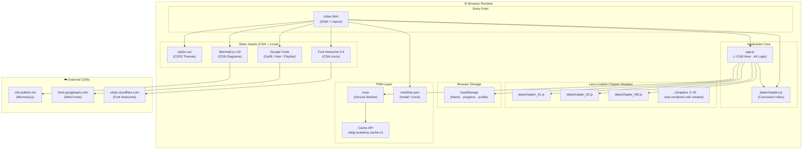
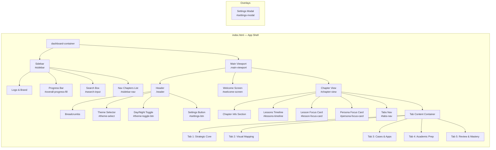
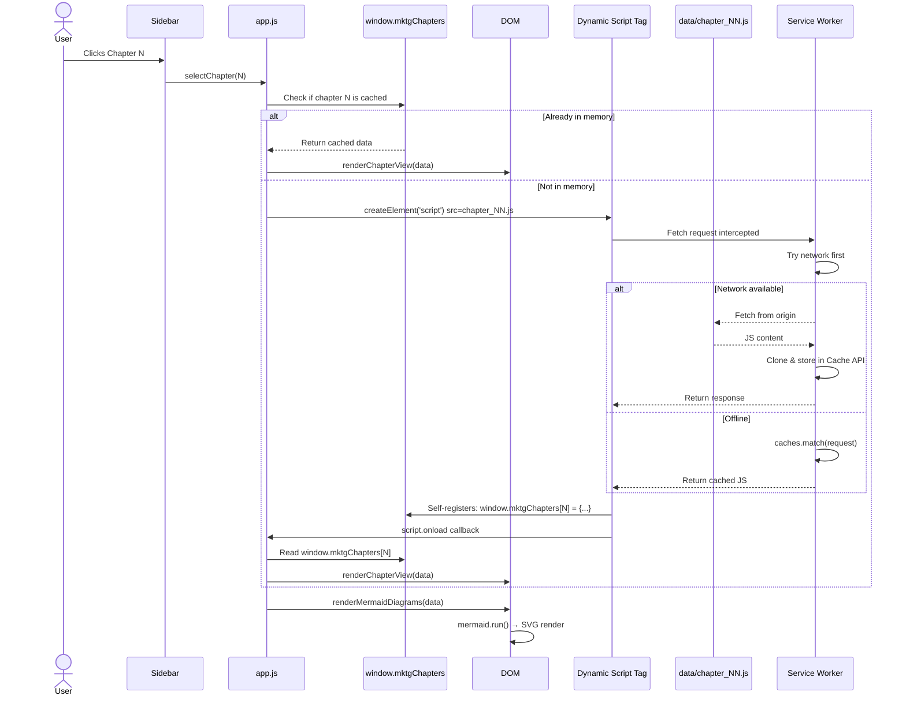
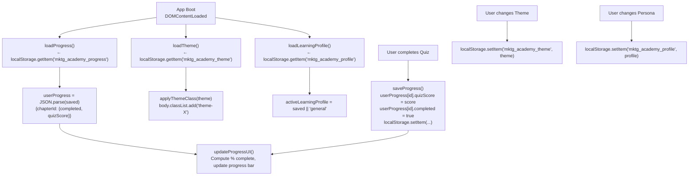
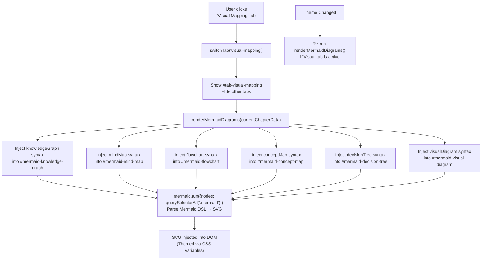
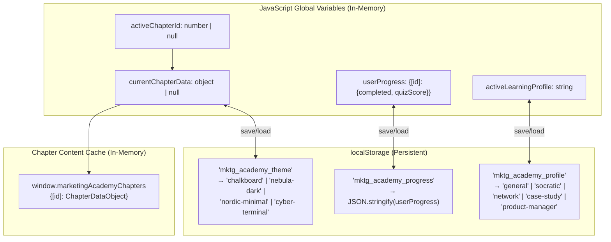
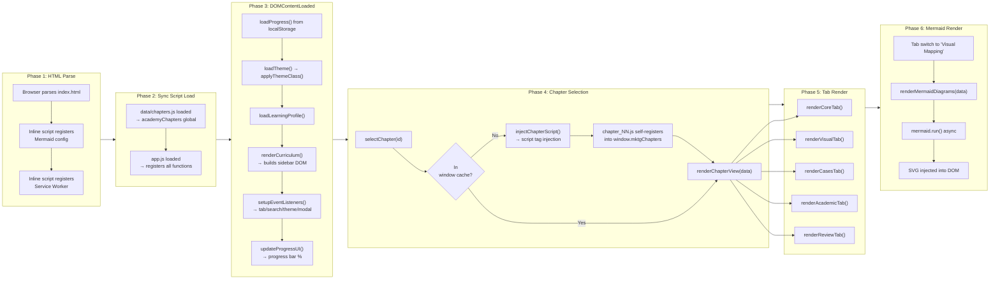
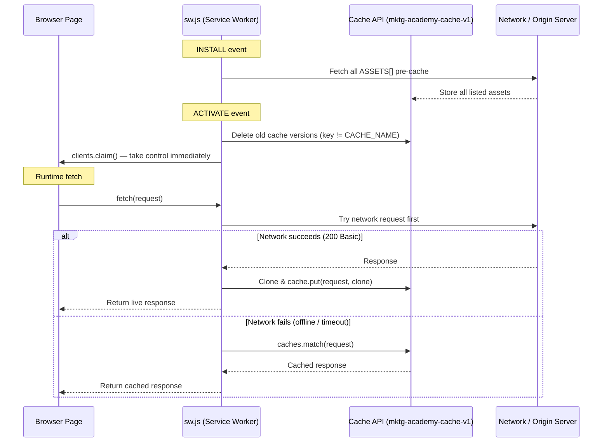
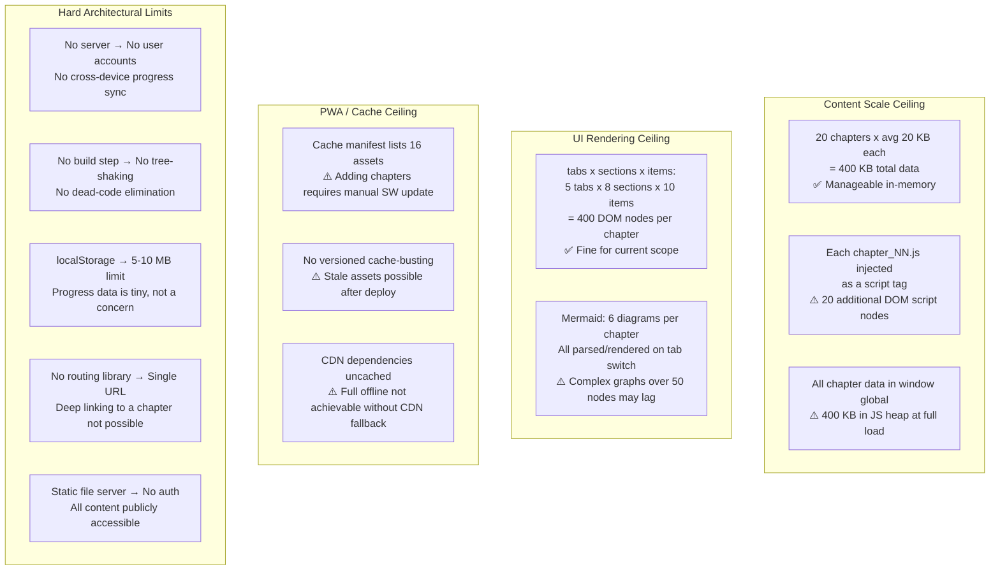

# Technical Architecture Document
## Marketing Mastery Academy

> **Version:** 1.0  
> **Date:** August 2026  
> **Stack:** Pure Vanilla HTML5 · CSS3 · JavaScript ES6+  
> **Repo:** GitHub Private — branch `main`  
> **Dev Server:** Python `http.server` (static files only)

---

## Table of Contents

1. [System Overview](#1-system-overview)
2. [File Structure](#2-file-structure)
3. [Component Architecture](#3-component-architecture)
4. [Data Layer & Module Responsibilities](#4-data-layer--module-responsibilities)
5. [Data Flow Diagrams](#5-data-flow-diagrams)
6. [State Management](#6-state-management)
7. [Rendering Pipeline](#7-rendering-pipeline)
8. [Caching Strategy (Service Worker)](#8-caching-strategy-service-worker)
9. [PWA Configuration](#9-pwa-configuration)
10. [External Dependencies](#10-external-dependencies)
11. [Performance Considerations](#11-performance-considerations)
12. [Scalability Limits](#12-scalability-limits)
13. [Technical Debt](#13-technical-debt)

---

## 1. System Overview

Marketing Mastery Academy is a **fully static, zero-build Progressive Web App** built without any framework, bundler, transpiler, or package manager. All application logic lives in a single monolithic `app.js`, layout in `index.html`, styling in `styles.css`, and curriculum content in per-chapter JS modules under `data/`.



---

## 2. File Structure

```
marketing masterclass/               ← Project Root
│
├── index.html                       ← App shell (598 lines) — All HTML structure
├── styles.css                       ← Master stylesheet (~47 KB) — 4 themes
├── app.js                           ← Application controller (~96 KB, 2128 lines)
│
├── manifest.json                    ← PWA Web App Manifest
├── sw.js                            ← Service Worker (cache-first strategy)
│
├── data/                            ← Curriculum Content Modules
│   ├── chapters.js                  ← Course catalog & lesson index (272 lines)
│   ├── chapter_01.js                ← Ch 1: Marketing & Customer Value
│   ├── chapter_02.js                ← Ch 2: Company & Marketing Strategy
│   └── chapter_07.js                ← Ch 7: Customer Value-Driven Strategy
│                                      (chapters 3–6, 8–20 use stub-render)
│
├── images/                          ← Static Image Assets
│   ├── icon-192.png                 ← PWA icon (192×192)
│   ├── icon-512.png                 ← PWA icon (512×512)
│   ├── figure_1_1_marketing_process.jpg
│   ├── figure_2_2_bcg_matrix.jpg
│   ├── figure_2_3_ansoff_grid.jpg
│   ├── figure_3_1_environment.jpg
│   ├── figure_5_1_buyer_behavior.jpg
│   ├── figure_7_1_stp_strategy.jpg
│   ├── figure_7_2_perceptual_map.jpg
│   ├── figure_8_1_product_levels.jpg
│   └── [figure sub-images: _1.jpg … _99.jpg per figure]
│
├── validate_data.js                 ← Dev utility: schema validator (Node.js)
├── extract_all_figures.py           ← Dev utility: extract images from DOCX
├── extract_docx.py                  ← Dev utility: parse textbook DOCX
└── scan_figures.py                  ← Dev utility: enumerate figure references
```

> [!NOTE]
> Dev utilities (`*.py`, `validate_data.js`) are **not served** by the app and have no runtime dependency. They exist only to assist content authoring.

---

## 3. Component Architecture

The app uses a **monolithic SPA pattern** — no custom element system, no shadow DOM, no component framework. All "components" are plain HTML DOM sections populated by vanilla JS render functions.



### Tab Content Components

| Tab | ID | Content Sections |
|-----|----|-----------------|
| Strategic Core | `tab-strategic-core` | Learning Objectives · First Principles · Definitions Grid · Intuition/Story · Strategy Frameworks · Comparative Matrix · Cross-Chapter Links · Mnemonics |
| Visual Mapping | `tab-visual-mapping` | Textbook Visuals · Roadmap Timeline · Knowledge Graph · Mind Map · Process Flowchart · Infographics · Concept Map · Decision Tree · Architecture Diagram |
| Cases & Apps | `tab-cases-applications` | Real-World Snippets · Industry Apps · Indian Case Study · Global Case Study · Monday Action Items · Common Mistakes |
| Academic Prep | `tab-academic-rigor` | Interview Q&A Accordion · MBA Exam Questions · Practice Exercises · Course Assignments · Strategic Mini-Scenarios |
| Review & Mastery | `tab-review-mastery` | One-Page Cheat Sheet · Feynman Review Challenge (textarea + analysis) · Chapter Mastery MCQ Assessment |

---

## 4. Data Layer & Module Responsibilities

### 4.1 Curriculum Index — `data/chapters.js`

Exports a single global array `academyChapters` describing the full 20-chapter, 4-part course structure. Each entry contains:

```js
{
  part: "PART 1: ...",
  chapters: [
    {
      id: 1,                          // Numeric chapter ID
      title: "...",                   // Display name
      file: "data/chapter_01.js",    // Lazy-load path
      lessons: ["Lesson 1 → ...", ...]// Lesson timeline items
    }
  ]
}
```

This file is loaded **synchronously** via a `<script>` tag in `index.html` before `app.js`, making `academyChapters` available as a global variable at app init.

### 4.2 Chapter Detail Modules — `data/chapter_NN.js`

Each chapter file **self-registers** into `window.marketingAcademyChapters[id]` when injected. Typical schema:

```js
window.marketingAcademyChapters = window.marketingAcademyChapters || {};
window.marketingAcademyChapters[1] = {
  id: 1,
  title: "...",
  learningObjectives: [...],        // Array<string>
  firstPrinciples: {
    statement: "...",
    explanation: "..."
  },
  definitions: [                    // Array<{term, definition, source}>
    { term: "...", definition: "...", source: "Textbook" | "Professional Insight" }
  ],
  intuition: { analogy: "...", story: "..." },
  frameworks: [                     // Array<{name, explanation, components[]}>
    { name: "...", explanation: "...", components: [...] }
  ],
  comparisonTable: {
    headers: [...],
    rows: [...]
  },
  crossLinks: [...],                // Array<string>
  memoryTechniques: [...],          // Array<{mnemonic, meaning}>
  visualRoadmap: [...],             // Array<{step, title, desc}>
  textbookVisuals: [...],           // Array<{src, caption, figureRef}>
  mermaidDiagrams: {
    knowledgeGraph: "graph LR...",
    mindMap: "mindmap...",
    flowchart: "flowchart TD...",
    conceptMap: "graph TB...",
    decisionTree: "flowchart LR...",
    visualDiagram: "graph..."
  },
  infographics: [...],              // Array<{label, value, icon, color}>
  cases: {
    realWorld: "...",
    industry: "...",
    indianCase: { company, scenario, analysis, outcome },
    globalCase: { company, scenario, analysis, outcome },
    practicalApplications: [...],
    commonMistakes: [...]
  },
  academic: {
    interviewQuestions: [...],      // Array<{q, a}>
    mbaQuestions: [...],
    exercises: [...],
    assignments: [...],
    scenarios: [...]
  },
  review: {
    onePage: "...",
    feynmanModel: "..."
  },
  quiz: [                           // Array<{question, options[], correct, explanation}>
    { question: "...", options: [...], correct: 0, explanation: "..." }
  ],
  personas: {                       // Persona-specific focus content
    general: { heading: "...", content: "..." },
    socratic: { heading: "...", content: "..." },
    network: { heading: "...", content: "..." },
    "case-study": { heading: "...", content: "..." },
    "product-manager": { heading: "...", content: "..." }
  }
};
```

### 4.3 `app.js` — Responsibility Map

| Function Group | Functions | Responsibility |
|---|---|---|
| **Initialization** | `DOMContentLoaded` handler | Boot sequence: load progress → load theme → load profile → render curriculum → setup listeners → update UI |
| **Theme Engine** | `loadTheme()`, `applyThemeClass()`, `updateToggleIcon()` | Read/write `localStorage`, toggle CSS body class, re-render Mermaid on theme switch |
| **Progress** | `loadProgress()`, `saveProgress()`, `updateProgressUI()` | Serialize/deserialize `userProgress` to localStorage, compute overall % completion |
| **Curriculum Render** | `renderCurriculum()` | Build sidebar navigation DOM tree from `academyChapters` global |
| **Chapter Loading** | `selectChapter()`, `injectChapterScript()`, `renderStubChapter()` | Cache-check → dynamic `<script>` injection → register in `window.marketingAcademyChapters` |
| **Chapter Rendering** | `renderChapterView()`, `renderCoreTab()`, `renderVisualTab()`, `renderCasesTab()`, `renderAcademicTab()`, `renderReviewTab()` | Populate all tab sections from chapter data object |
| **Mermaid Rendering** | `renderMermaidDiagrams()` | Inject Mermaid syntax into `.mermaid` divs, call `mermaid.run()` |
| **Search** | `performSearch()`, `renderSearchResults()` | In-memory fuzzy match across `academyChapters` lesson titles |
| **Quiz Engine** | `renderQuiz()`, `evaluateQuiz()`, `saveQuizResult()` | Multi-choice quiz render, validation, score recording |
| **Feynman Engine** | `analyzeFeynman()` | Keyword-match analysis of user textarea vs. chapter key concepts |
| **Persona System** | `loadLearningProfile()`, `renderPersonaFocusContent()` | Read/write persona from localStorage, render persona-specific content panel |
| **Notes Export** | `downloadChapterNotes()` | Generate plain-text file from chapter data and trigger browser download |
| **Event Handlers** | `setupEventListeners()` | Tab switches, sidebar toggle, settings modal, search input debounce |

---

## 5. Data Flow Diagrams

### 5.1 Chapter Load Flow



### 5.2 State Persistence Flow



### 5.3 Mermaid Rendering Flow



---

## 6. State Management

The app uses a **zero-library, plain-object state pattern** with `localStorage` as the persistence layer.



### State Variables

| Variable | Type | Scope | Persistence |
|---|---|---|---|
| `activeChapterId` | `number \| null` | Module global | None (reset on reload) |
| `currentChapterData` | `object \| null` | Module global | None (re-loaded from cache) |
| `userProgress` | `{[id]: {completed, quizScore}}` | Module global | `localStorage` |
| `activeLearningProfile` | `string` | Module global | `localStorage` |
| `window.marketingAcademyChapters` | `{[id]: object}` | `window` global | None (in-session only) |

> [!IMPORTANT]
> There is **no reactive state system**. All UI updates are imperative — functions directly manipulate DOM nodes. State mutations must be followed by manual UI update calls (e.g., `saveProgress()` calls `updateProgressUI()` internally).

---

## 7. Rendering Pipeline



### Rendering Notes

- **All rendering is synchronous** (except Mermaid's async SVG generation).
- **No virtual DOM or diffing** — every `renderXxxTab()` call wipes the container's `innerHTML` and rebuilds from scratch.
- **Mermaid is deferred** until the Visual Mapping tab is activated to avoid rendering SVGs in hidden containers (causes collapsed dimensions).
- **Theme changes** trigger a Mermaid re-render if the Visual tab is currently active, since Mermaid SVG styles are baked in at render time.

---

## 8. Caching Strategy (Service Worker)

The SW uses a **Network-First with Cache Fallback** strategy.



### Pre-cached Assets (Static Manifest — `sw.js` ASSETS array)

| Asset | Type |
|---|---|
| `index.html` | App Shell |
| `styles.css` | Stylesheet |
| `app.js` | Application Logic |
| `manifest.json` | PWA Manifest |
| `data/chapters.js` | Chapter Index |
| `data/chapter_01.js` | Chapter 1 Data |
| `data/chapter_02.js` | Chapter 2 Data |
| `data/chapter_07.js` | Chapter 7 Data |
| `images/icon-192.png` | PWA Icon |
| `images/icon-512.png` | PWA Icon |
| 8× `images/figure_*.jpg` | Primary Textbook Visuals |

> [!WARNING]
> **Cache Invalidation**: The cache name is `mktg-academy-cache-v1` — a hardcoded string. Updating cached assets requires bumping the version string in `sw.js` AND redeploying. There is **no automatic cache-busting** on file content change.

> [!NOTE]
> **CDN resources** (Mermaid.js, Google Fonts, Font Awesome) are **not** pre-cached by the SW. The app is not fully offline-capable for first-load or when CDN assets have expired from the browser HTTP cache.

---

## 9. PWA Configuration

### `manifest.json`

| Property | Value |
|---|---|
| `name` | Marketing Mastery Academy |
| `short_name` | MktgAcademy |
| `start_url` | `index.html` |
| `display` | `standalone` |
| `background_color` | `#0a0c10` (dark) |
| `theme_color` | `#cca04c` (gold) |
| `orientation` | `any` |
| `icons` | 192×192 + 512×512 PNG |

### SW Registration

Registered in `index.html` via inline `<script>` on the `window load` event:

```js
if ('serviceWorker' in navigator) {
  window.addEventListener('load', () => {
    navigator.serviceWorker.register('sw.js');
  });
}
```

- `skipWaiting()` is called on install → new SW activates immediately.
- `clients.claim()` is called on activate → SW takes control of all open tabs without requiring a reload.

---

## 10. External Dependencies

All external dependencies are loaded via CDN — no local copies, no npm installs.

| Dependency | Version | CDN | Purpose | Loaded |
|---|---|---|---|---|
| Mermaid.js | `@10` (latest v10) | `cdn.jsdelivr.net` | Diagrams: mindmaps, flowcharts, knowledge graphs, decision trees | `<head>` — synchronous |
| Google Fonts | N/A | `fonts.googleapis.com` | Outfit (headings), Inter (body), Playfair Display (accents) | `<head>` — preconnect + link |
| Font Awesome | `6.4.0` | `cdnjs.cloudflare.com` | Icon system (650+ icons used) | `<head>` — stylesheet |

### Mermaid Configuration

Mermaid is initialized in `index.html` with `startOnLoad: false` (manual trigger via `mermaid.run()`), using custom theme variables that align with the app's design system:

```js
mermaid.initialize({
  startOnLoad: false,
  theme: 'base',
  themeVariables: {
    background: 'transparent',
    primaryColor: '#d8a84a',      // Gold
    primaryTextColor: '#eae6df',  // Off-white
    lineColor: '#7d7973',         // Muted gray
    secondaryColor: '#191c21',    // Dark surface
    tertiaryColor: '#242930',     // Card surface
    fontFamily: "'Inter', sans-serif"
  }
});
```

---

## 11. Performance Considerations

### 11.1 Strengths

| Factor | Impact |
|---|---|
| **No framework overhead** | Zero bundle overhead. No React/Vue/Angular runtime. |
| **Lazy chapter loading** | Chapter data files (~20 KB each) loaded on-demand via dynamic `<script>` injection, not at startup. |
| **In-memory chapter cache** | Once loaded, a chapter's data is stored in `window.marketingAcademyChapters` and never re-fetched within a session. |
| **SW Network-First caching** | Pages served from cache on offline, fresh content fetched when online. |
| **CSS-only theme system** | Theme switching is a single `body.classList` mutation — no JS re-renders required for purely visual changes. |
| **Mermaid deferred render** | Diagrams only rendered when Visual Mapping tab is active, avoiding wasted CPU on hidden SVGs. |

### 11.2 Bottlenecks & Risks

| Issue | Severity | Detail |
|---|---|---|
| **`app.js` is 96 KB** | Medium | Entire app logic in one file. Browser must parse all 2128 lines before any logic runs. No code splitting possible without a bundler. |
| **`innerHTML` thrashing** | Medium | Every tab render wipes and rebuilds its entire DOM subtree (`innerHTML = ''`). Heavy chapters can cause janky reflow. |
| **Mermaid v10 CDN size** | Medium-High | Mermaid.js min is ~2.5 MB. Loaded synchronously in `<head>`, blocking render until the CDN responds. No async/defer. |
| **Google Fonts FOUT** | Low | Font Awesome and Google Fonts loaded via CDN. Flash of Unstyled Text (FOUT) visible on first load until fonts cache. |
| **No image lazy loading** | Low | All textbook figure `` elements in the Visual Mapping tab are created eagerly. Large images (up to 750 KB) load simultaneously. |
| **Feynman analysis is client-side** | Low | Keyword matching done in JS. No semantic analysis. Limited educational value for edge-case inputs. |
| **Search is O(n) full scan** | Low | Search iterates all `academyChapters` + all lesson strings. Acceptable at current scale (20 chapters × ~10 lessons). |

---

## 12. Scalability Limits



### Practical Ceiling

The architecture comfortably supports:
- ✅ **20 chapters** × **~15 lessons** each (current design)
- ✅ **~400 KB** total chapter data (20 × 20 KB average)
- ✅ **6 Mermaid diagrams** per chapter
- ⚠️ Beyond **50 chapters**, in-memory chapter cache and DOM complexity become problematic

---

## 13. Technical Debt

> [!CAUTION]
> The following items represent known architectural limitations. They are not bugs — the app functions correctly — but they are **constraints that will require refactoring** as the project scales.

### TD-001 — Monolithic `app.js`

| Property | Detail |
|---|---|
| **Risk** | High at scale |
| **Description** | All 2128 lines of application logic (rendering, state, search, quiz, Mermaid, themes, events) live in a single file. No modules, no imports/exports. |
| **Consequence** | Poor maintainability, no tree-shaking, no dead-code elimination, increased cognitive load for contributors. |
| **Remediation** | Split into ES6 modules (`modules/render.js`, `modules/quiz.js`, `modules/search.js`, etc.) when/if a build step is introduced, or use native ES6 `type="module"` imports. |

### TD-002 — Hardcoded SW Asset Manifest

| Property | Detail |
|---|---|
| **Risk** | Medium |
| **Description** | `sw.js` `ASSETS` array is manually maintained. Every new chapter file added must also be added to this list. |
| **Consequence** | New chapters (3–6, 8–20) will not be pre-cached or available offline until `sw.js` is updated. Cache version must be bumped manually on each update. |
| **Remediation** | Implement a build script or Python utility that auto-generates the SW asset list from the file system. |

### TD-003 — No Deep Linking / URL Routing

| Property | Detail |
|---|---|
| **Risk** | Medium (UX) |
| **Description** | The app is a single-URL SPA with no hash routing or History API. All chapters render on `index.html`. |
| **Consequence** | Cannot bookmark a specific chapter. Cannot share a link to a lesson. Browser back/forward does not navigate chapters. |
| **Remediation** | Implement `window.history.pushState()` or `location.hash` routing in `selectChapter()`. |

### TD-004 — Chapter Stubs (Chapters 3–6, 8–20)

| Property | Detail |
|---|---|
| **Risk** | High (content) |
| **Description** | Only chapters 1, 2, and 7 have full data files. All other chapters fall back to `renderStubChapter()` which uses `generateStubData()` to produce placeholder content. |
| **Consequence** | 17 of 20 chapters display stub/template content. Core learning value is unavailable for 85% of the curriculum. |
| **Remediation** | Create `data/chapter_NN.js` files for all remaining chapters following the established schema. |

### TD-005 — No Error Boundaries

| Property | Detail |
|---|---|
| **Risk** | Medium |
| **Description** | If a `chapter_NN.js` file has a JS syntax error or schema mismatch, the `script.onerror` handler logs a warning and falls back to stub. No user-visible error state is shown. |
| **Consequence** | Silent data failures. A corrupted chapter file produces a stub view with no indication something went wrong. |
| **Remediation** | Add explicit try/catch around data access and render a user-visible error card with details. |

### TD-006 — `innerHTML` as the Rendering Primitive

| Property | Detail |
|---|---|
| **Risk** | Low-Medium |
| **Description** | All tab renders use direct `innerHTML` assignment with template literals that include chapter data. |
| **Consequence** | Potential XSS vector if chapter data ever includes user-generated or untrusted HTML strings. Current data is developer-authored, so risk is contained. |
| **Remediation** | Use `textContent` for user-facing strings; use `DOMParser` or `createElement`-based DOM building for structural HTML. |

### TD-007 — CDN Dependency at Runtime

| Property | Detail |
|---|---|
| **Risk** | Medium |
| **Description** | Mermaid.js (~2.5 MB), Google Fonts, and Font Awesome are loaded from external CDNs at runtime with no fallback. |
| **Consequence** | App partially broken (no diagrams) if Mermaid CDN is unreachable. Visual degradation if fonts fail. Not truly offline-capable. |
| **Remediation** | Vendor Mermaid.js locally (`/vendor/mermaid.min.js`). Use `font-display: swap` and system font fallbacks. Add CDN assets to SW cache. |

### TD-008 — No Automated Testing

| Property | Detail |
|---|---|
| **Risk** | Medium |
| **Description** | No unit tests, integration tests, or E2E tests. `validate_data.js` is a manual Node.js schema validator, not a test runner. |
| **Consequence** | Regressions in rendering logic or data schema can go undetected until manual review. |
| **Remediation** | Add Jest or Vitest unit tests for render functions and quiz logic. Add Playwright E2E tests for chapter navigation and quiz completion. |

---

*Document generated: August 2026 · Marketing Mastery Academy v1.0*
